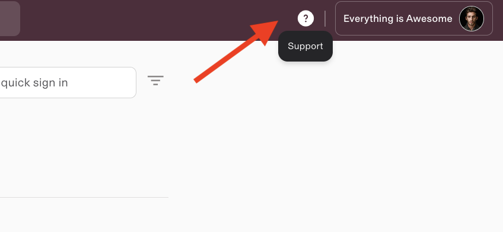

## Headers

**Subject:** Rippling Implementation: CounselFi - Introduction to Support
**From:** Mike Velez <mvelez@rippling.com>
**Date:** 2025-03-24 16:03
**To:** Tamara Brenes <tb@counselfi.com>, James Delaney <jdelaney@counselfi.com>

## Attachments
- [image.png](attachments/image.png)

## Body

Hi Tamara & James,

I'm excited to let you know that at this time, you have completed implementation with Rippling and your service is transitioning to our Support team.

Here’s how to get in touch with Rippling Support:

To access support, you can reach out using this [link](<https://app.rippling.com/help?q_mailing_7TUvzhdFxJeQo9QbskUkwM2GSjQG1DQufGkZA=RoogEjnPRYLFrDSMN1wLqewVCeESyZ8RKvBnWZRLnYtbngD3tSSCxvS1a>). You can find this button at the top of your Rippling navigation where it says “Support”. From this page, you can access:

  * Help Center - “how to” guides, tutorials, FAQs, and more

  * Rippling Support Live Chat

  * Rippling U - free on-demand product training courses

We’re able to resolve most of your issues through our Support Chat. If support is unable to resolve your issue via chat, they will often provide a video call. A Rippling team member will be available from 6:00 am - 5:00 pm PST to quickly address your needs! Our support team is the best in the business - we publish our live, real-time support stats [here](<https://www.rippling.com/support-status?q_mailing_7TUvzhdFxJeQo9QbskUkwM2GSjQG1DQufGkZA=RoogEjnPRYLFrDSMN1wLqewVCeESyZ8RKvBnWZRLnYtbngD3tSSCxvS1a>). If you want a quick overview of our support process, you can find more information in our [help center](<https://help.rippling.com/s/article/360054486174?q_mailing_7TUvzhdFxJeQo9QbskUkwM2GSjQG1DQufGkZA=RoogEjnPRYLFrDSMN1wLqewVCeESyZ8RKvBnWZRLnYtbngD3tSSCxvS1a>).

** _Implementation Survey_**

In the next week, you will receive an email requesting that you complete a short survey about your experience implementing Rippling. Please take a moment to complete this survey so we can continue to improve our implementation process. We appreciate your feedback!

It has been a pleasure working with you!

\--

Mike Velez

Implementation Manager | [Rippling.com](<https://www.rippling.com/?q_mailing_7TUvzhdFxJeQo9QbskUkwM2GSjQG1DQufGkZA=RoogEjnPRYEZ4niF1NkpoN3zCA5GdUVUbiXscFr9BuiamFn6MSy5cJPd6>)

Book time with me [here](<https://calendly.com/ripplingmikev?q_mailing_7TUvzhdFxJeQo9QbskUkwM2GSjQG1DQufGkZA=RoogEjnPRYEZ4niF1NkpoN3zCA5GdUVUbiXscFr9BuiamFn6MSy5cJPd6>).

Have a question? Visit[ Rippling's Help Center](<https://support.rippling.com/?q_mailing_7TUvzhdFxJeQo9QbskUkwM2GSjQG1DQufGkZA=RoogEjnPRYEZ4niF1NkpoN3zCA5GdUVUbiXscFr9BuiamFn6MSy5cJPd6>)

Please note: Although my goal is to respond as quickly as possible, please allow up to 24 business hours for a response to any questions. Additionally, please DO NOT cancel with your existing payroll provider until you run your first successful payroll with us.

