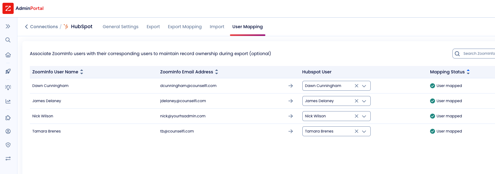

## Headers

**Subject:** Re: dawn's user not in hs
**From:** Nick Wilson <nick@yourhsadmin.com>
**Date:** 2025-09-13 13:14
**To:** James Delaney <jdelaney@counselfi.com>

## Attachments
- [image.png](attachments/image.png)
- [image.png](attachments/image.png)

## Body

Not sure - she's mapped according to this screen and she's been successfully exporting contacts into HubSpot:

On Sat, Sep 13, 2025 at 8:29 AM James Delaney < [jdelaney@counselfi.com](mailto:jdelaney@counselfi.com)> wrote:

> do you know why? 

